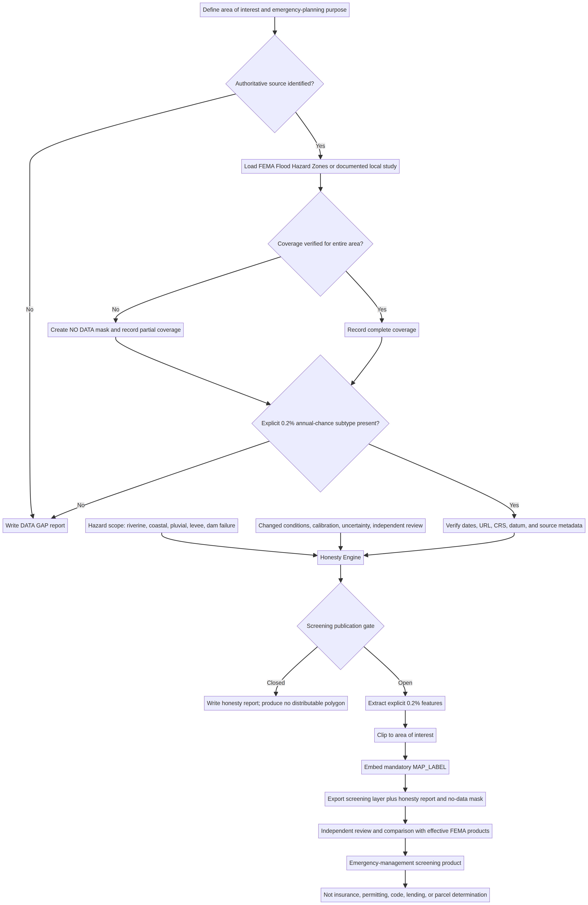

# 0.2% Annual-Chance Floodplain Honesty Toolkit

## Emergency-management screening with explicit limits

This toolkit helps emergency managers prepare a traceable screening layer for the flood that has a **0.2% annual chance of being equaled or exceeded in any year**, commonly called the “500-year flood.” The phrase does not mean that such a flood occurs on a 500-year schedule. Under a constant and independent annual probability assumption, a location in the 0.2% annual-chance area has about a **5.83% chance** of at least one exceedance during a 30-year period.

FEMA distinguishes this area from the **1% annual-chance Special Flood Hazard Area (SFHA)**. FEMA generally depicts moderate flood hazard as Zone B or shaded Zone X between the 1% and 0.2% annual-chance limits. Shaded Zone X can also represent certain shallow-flooding, small-drainage-area, or levee-related conditions, so this toolkit does not classify every Zone X polygon as an explicit 0.2% boundary.[1] [2]

> **Safety boundary:** This toolkit produces planning and emergency-management screening information. It does not make insurance, lending, permitting, building-code, elevation-certificate, Letter of Map Change, or parcel-level determinations. The current effective FEMA products and the local floodplain administrator remain authoritative for official decisions.

## What the toolkit does

The core engine evaluates operator-documented source authority, presence of an explicit 0.2% annual-chance boundary, geographic coverage, provenance evidence, coordinate reference information, technical review, uncertainty, and changed conditions. The QGIS algorithm spatially limits the source to the area of interest, extracts only records whose subtype explicitly contains `0.2 PCT ANNUAL CHANCE FLOOD HAZARD`, writes a machine-readable honesty report, and embeds mandatory warning and provenance fields in the output.

The algorithm **fails closed**. If a source is missing, coverage is unconfirmed, provenance or metadata is incomplete, the coordinate reference system is invalid, changed conditions are unreviewed, or a local model lacks required review, it writes the report but produces no distributable floodplain layer. The toolkit validates FEMA-domain URLs and requires a product identifier, named verifier, and coverage-evidence record, but it does not independently authenticate those operator-entered records.

| Component | Purpose |
| --- | --- |
| `floodplain_honesty_engine.py` | Standalone validation and publication-gate engine with text and JSON reporting. |
| `qgis_floodplain_algorithm.py` | QGIS Processing algorithm for explicit 0.2% annual-chance extraction and clipping. |
| `assessment_input.example.json` | Complete example input showing required source and scope metadata. |
| `SAMPLE_REPORT.json` and `SAMPLE_REPORT.txt` | Reproducible fictional demonstration reports generated from the example input. |
| `METHODOLOGY.md` | Scoring, confidence classes, refusal conditions, and modeling limits. |
| `QGIS_WORKFLOW_GUIDE.md` | Reproducible desktop workflow using downloaded or live FEMA data. |
| `QUICK_START_GUIDE.md` | Short operational sequence for emergency managers. |
| `COMMUNITY_FIELD_GUIDE.md` | High-water-mark and local-observation practices that preserve provenance. |
| `architecture_diagram.mmd` and `architecture_diagram.png` | Source-controlled architecture diagram and rendered reference image. |
| `tests/` | Regression tests for probability, validation, and fail-closed behavior. |



## Choose a FEMA data-access method

FEMA identifies the National Flood Hazard Layer (NFHL) as a database of current effective flood hazard data assembled from effective maps and Letters of Map Change. FEMA also notes that digital NFHL coverage is not universal and that new data are added continuously.[3] This toolkit supports both data-access methods below without treating either as complete by default.

| Approach | Tradeoffs | Cost | Setup complexity |
| --- | --- | --- | --- |
| Download county or state NFHL data from the FEMA Map Service Center | Best for reproducible and offline emergency products. The dataset can be archived with its retrieval date, but the operator must check for later revisions and Letters of Map Change. | Free | Low to moderate |
| Connect QGIS to FEMA’s public REST or WFS service | Convenient for exploration and current service content. It depends on network availability and service continuity; FEMA documents a 1,000-feature WFS request limit and recommends a small bounding box or downloaded data for larger requests.[4] | Free | Moderate |

For an incident package or published planning product, a downloaded county or state dataset is usually easier to archive and reproduce. A live service is useful for reconnaissance and update checks. In either case, verify the **NFHL Availability** layer or dataset metadata for the entire area of interest; missing coverage must be labeled **NO DATA**, never low risk.[3] [4]

## Standalone assessment

Python 3.9 or later is sufficient for the core engine. It uses only the standard library.

```bash
cd tools/floodplain-honesty-toolkit
cp assessment_input.example.json my_assessment.json
# Replace every example field with actual source and scope information.
python3 floodplain_honesty_engine.py \
  --input my_assessment.json \
  --json-output floodplain_honesty_report.json \
  --text-output floodplain_honesty_report.txt
```

The engine always sets `regulatory_use_allowed` to `false`. A publication gate marked `OPEN` means only that the operator-documented source, provenance, coverage, changed-condition review, and metadata support a **screening map** under this toolkit’s rules.

## QGIS use

Copy `floodplain_honesty_engine.py` and `qgis_floodplain_algorithm.py` into the same QGIS Processing scripts directory. Load the FEMA **Flood Hazard Zones** polygon layer and an area-of-interest polygon. Run **Extract 0.2% Annual-Chance Flood Area (Honesty First)** from the Processing Toolbox.

The public effective NFHL REST service is:

```text
https://hazards.fema.gov/arcgis/rest/services/public/NFHL/MapServer
```

FEMA currently identifies **layer 28** as `Flood Hazard Zones`. The service stores the NFHL in NAD83 and may support Web Mercator through web services. FEMA also limits detailed layer display to appropriate scales and requires suitable base-map accuracy for official uses.[4]

See `QGIS_WORKFLOW_GUIDE.md` before distributing an output.

## When no acceptable 0.2% boundary exists

Do not create a terrain-only “500-year floodplain” by buffering streams or filling a digital elevation model. Those operations do not estimate a 0.2% annual-exceedance-probability discharge or convert that discharge into defensible water-surface elevations. A new boundary requires qualified hydrologic and hydraulic analysis, documented terrain and structures, calibration or verification against gages or observed high-water marks, uncertainty analysis, and independent review. USGS Bulletin 17C is the federal guideline for flood-flow frequency analysis, and FEMA’s accepted hydraulic-model guidance repeatedly emphasizes calibration or verification using observed events.[5] [6] [7]

The correct toolkit result for a missing or unreviewed boundary is a **data-gap report**, not a persuasive-looking polygon.

## Hazard scope that must remain explicit

| Hazard or condition | Default treatment |
| --- | --- |
| Riverine flooding | Unknown until the source and study scope are checked. |
| Coastal flooding and waves | Unknown until the coastal study scope is checked. |
| Pluvial or urban-drainage flooding | Excluded unless separately modeled. FEMA notes that heavy rain and poor drainage can cause flooding away from rivers and coasts.[8] |
| Levee-related flooding | Unknown until accreditation, residual risk, and overtopping or breach assumptions are checked. |
| Dam-failure flooding | Excluded unless a separate dam-break study is supplied. |
| Future climate, land use, wildfire, erosion, or drainage changes | Not represented merely because an effective map is current; changed conditions require a separate review. |

## Tests

```bash
python3 -m unittest discover -s tests -p 'test_*.py'
python3 -m py_compile floodplain_honesty_engine.py qgis_floodplain_algorithm.py
```

The QGIS script can be byte-compiled outside QGIS, but end-to-end geoprocessing validation requires QGIS 3 and representative FEMA data.

## License

The toolkit code and original documentation are provided under the MIT License. FEMA, USGS, local-government, and third-party datasets retain their own terms and authoritative status.

## References

[1]: https://www.fema.gov/about/glossary/flood-zones "FEMA Flood Zones"
[2]: https://www.fema.gov/about/glossary/zone-b-and-x-shaded "FEMA Zone B and X (Shaded)"
[3]: https://www.fema.gov/flood-maps/national-flood-hazard-layer "FEMA Flood Data Viewers and Geospatial Data"
[4]: https://hazards.fema.gov/femaportal/wps/portal/NFHLWMS "GIS Web Services for the FEMA National Flood Hazard Layer"
[5]: https://pubs.usgs.gov/publication/tm4B5 "USGS Guidelines for Determining Flood Flow Frequency—Bulletin 17C"
[6]: https://www.fema.gov/flood-maps/guidance-reports/guidelines-standards "FEMA Guidelines and Standards for Flood Risk Analysis and Mapping"
[7]: https://www.fema.gov/flood-maps/products-tools/numerical-models/hydraulic "FEMA Hydraulic Numerical Models Meeting the Minimum Requirement of National Flood Insurance Program"
[8]: https://www.fema.gov/flood-maps "FEMA Flood Maps"
